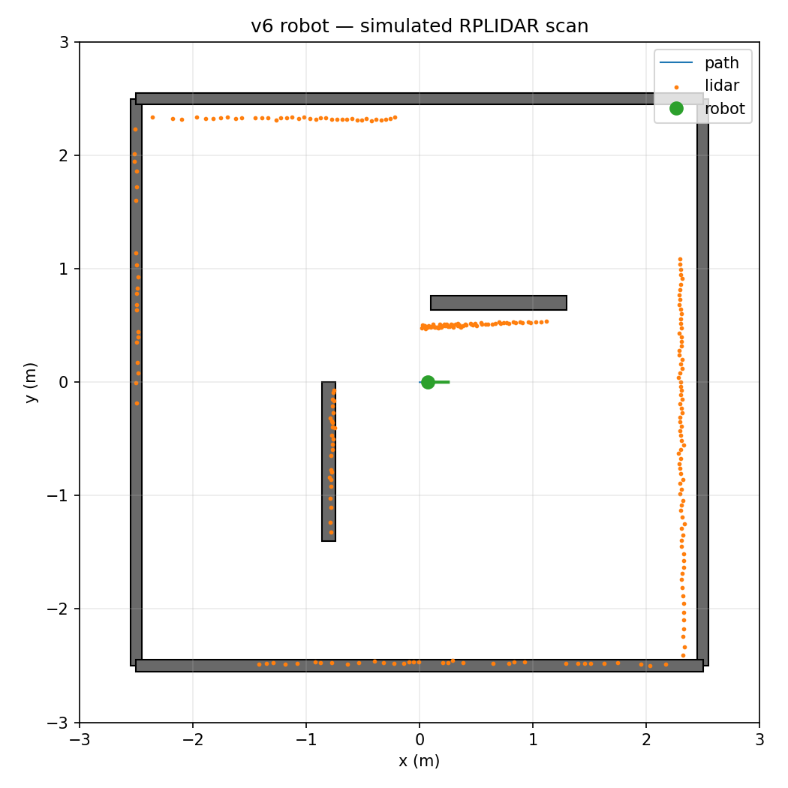

# Homer: mobile manipulation engineering

Homer combines an ESP32, Raspberry Pi, ROS 2 Jazzy, a differential-drive base, an SO-ARM 101 and an RPLIDAR A1.

## Engineering scope

- Embedded firmware and micro-ROS integration.
- Gamepad coordination, dead-man controls and separate command sources.
- Raspberry Pi services, device integration and arm bridge.
- PyBullet robot model, simulated LiDAR and workspace inspection.
- Robot-specific calibration and physical verification procedures.

## Simulation preview

This image is simulation output, not a hardware validation result.

## Current status

This is active integration work for one physical robot. Named arm poses and repeatable slow motion are prerequisites for automated grasping. The reachable-workspace model still needs physical calibration and clearance checks. The current arm mounting does not support floor pickup; grasp tests use a raised rigid platform.

End-to-end autonomous fetching and measured grasp or navigation success rates are not established by this showcase.

## Implementation

Start with the [main README](README.md), [simulation guide](simulation/README.md), [Pi runtime](pi/README.md) and [gamepad coordinator](pi/robot_teleop/README.md).

## Before public release

Add a physical robot photograph, a short demonstrated-task video, personal contribution and reuse attribution, and measured results including failed attempts. This showcase remains inside the private repository pending a publishing decision.
